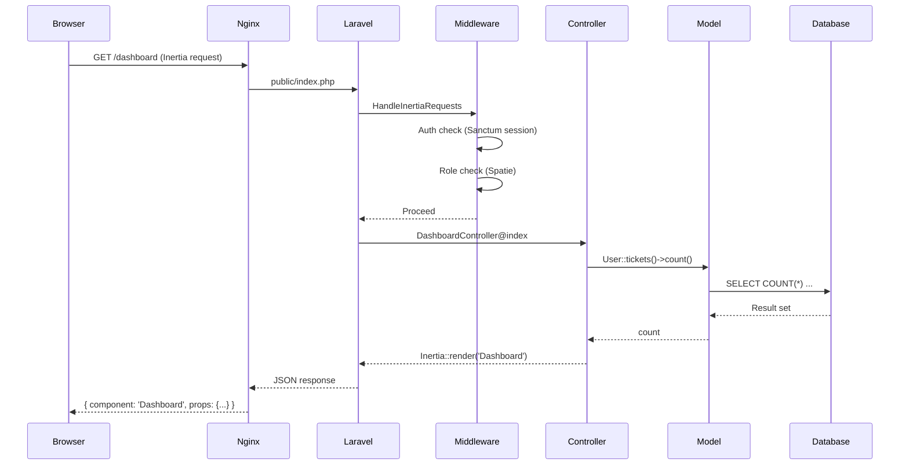
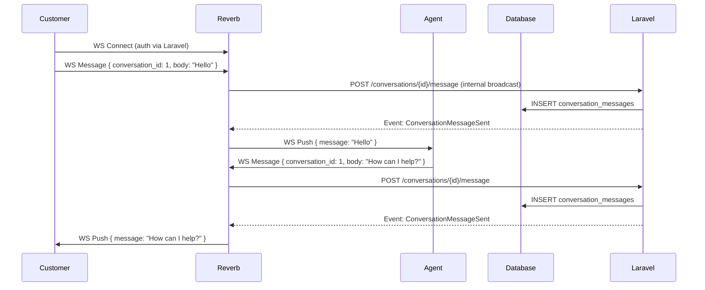

# 02 — System Architecture

## High-Level Architecture Diagram

```
┌─────────────────────────────────────────────────────────────────────┐
│                          CLIENT LAYER                               │
│  ┌──────────┐  ┌──────────┐  ┌──────────┐  ┌──────────┐          │
│  │ Browser  │  │  Mobile  │  │  PWA     │  │  API     │          │
│  │ (Vue 3)  │  │  (Web)   │  │  (SW)    │  │  Client  │          │
│  └────┬─────┘  └────┬─────┘  └────┬─────┘  └────┬─────┘          │
│       │              │              │              │                │
└───────┼──────────────┼──────────────┼──────────────┼────────────────┘
        │              │              │              │
        │   HTTPS      │   HTTPS      │   HTTPS      │   Bearer Token
        ▼              ▼              ▼              ▼
┌─────────────────────────────────────────────────────────────────────┐
│                      WEB SERVER (Nginx/Apache)                      │
│  ┌──────────────────────────────────────────────────────────────┐  │
│  │                  Laravel Application                         │  │
│  │                         │                                    │  │
│  │  ┌─────────────────────────────────────────────────────┐    │  │
│  │  │              MIDDLEWARE LAYER                        │    │  │
│  │  │  HandleInertia | Auth | Role | RateLimit | CSRF     │    │  │
│  │  └─────────────────────────────────────────────────────┘    │  │
│  │                         │                                    │  │
│  │  ┌─────────────────────────────────────────────────────┐    │  │
│  │  │              CONTROLLER LAYER                        │    │  │
│  │  │  Web Controllers ──── Admin Controllers             │    │  │
│  │  │  Auth Controllers ─── API Controllers               │    │  │
│  │  └─────────────────────────────────────────────────────┘    │  │
│  │                         │                                    │  │
│  │  ┌─────────────────────────────────────────────────────┐    │  │
│  │  │              SERVICE LAYER (planned)                 │    │  │
│  │  │  TicketService | AiService | SeoService             │    │  │
│  │  │  AutomationService | AnalyticsService               │    │  │
│  │  └─────────────────────────────────────────────────────┘    │  │
│  │                         │                                    │  │
│  │  ┌─────────────────────────────────────────────────────┐    │  │
│  │  │              MODEL LAYER (Eloquent ORM)              │    │  │
│  │  │  26 Models | Relations | Casts | Scopes             │    │  │
│  │  └─────────────────────────────────────────────────────┘    │  │
│  └──────────────────────────────────────────────────────────────┘  │
└─────────────────────────────────────────────────────────────────────┘
        │                    │                    │
        ▼                    ▼                    ▼
┌──────────────┐  ┌──────────────┐  ┌──────────────┐
│   MySQL 8.0  │  │  Queue       │  │  Reverb      │
│   Database   │  │  Worker      │  │  WebSocket   │
└──────────────┘  └──────────────┘  └──────────────┘
        │                    │                    │
        ▼                    ▼                    ▼
┌──────────────┐  ┌──────────────┐  ┌──────────────┐
│  File Store  │  │  Redis       │  │  AI Provider │
│  (uploads)   │  │  (optional)  │  │  APIs (HTTP) │
└──────────────┘  └──────────────┘  └──────────────┘
```

### Mermaid Sequence: Request Lifecycle



### Mermaid Sequence: Real-Time Chat (WebSocket)



---

## Technology Stack Decisions & Rationale

| Decision | Choice | Rationale |
|----------|--------|-----------|
| Backend Framework | Laravel 13 | Mature ecosystem, excellent DX, built-in queue/cache/broadcasting |
| Auth Scaffold | Breeze + Vue/Inertia | Lightweight, SPA-like UX without separate API, SSR-ready |
| Frontend | Vue 3 + Inertia.js | Component-based UI with server-side routing, no need for client-side router |
| CSS | TailwindCSS 3 | Utility-first, fast prototyping, consistent design system |
| Roles/Permissions | Spatie Laravel Permission | Battle-tested, RBAC + direct permissions, cache-efficient |
| API Auth | Laravel Sanctum | Simple token auth, SPA auth support, no OAuth complexity |
| WebSocket Server | Laravel Reverb | First-party, scales via Redis pub/sub, built for Laravel ecosystem |
| Build Tool | Vite 8 | Fast HMR, native ESM, Laravel Vite plugin support |
| Database | MySQL 8.0+ | JSON column support, full-text indexes, robust for production |
| Queue | Database → Redis | DB for dev simplicity, Redis for production performance |

---

## Directory Structure

```
app/                                     # Application code
├── Enums/
│   └── TicketStatus.php                 # open, in_progress, waiting, resolved, closed
├── Http/
│   ├── Controllers/
│   │   ├── Admin/                       # Admin panel controllers (15+)
│   │   │   ├── DashboardController.php
│   │   │   ├── TicketController.php
│   │   │   ├── DepartmentController.php
│   │   │   ├── CategoryController.php
│   │   │   ├── UserController.php
│   │   │   ├── ConversationController.php
│   │   │   ├── KnowledgeController.php
│   │   │   ├── ServiceController.php
│   │   │   ├── CannedResponseController.php
│   │   │   ├── SlaPolicyController.php
│   │   │   ├── AutomationRuleController.php
│   │   │   ├── AiProviderController.php
│   │   │   ├── AiFeatureController.php
│   │   │   ├── PostController.php
│   │   │   ├── EmailTemplateController.php
│   │   │   ├── SettingsController.php
│   │   │   ├── ActivityLogController.php
│   │   │   ├── ApiKeyController.php
│   │   │   ├── AnalyticsController.php
│   │   │   └── FrontPageController.php
│   │   ├── Auth/                        # Breeze auth controllers (10)
│   │   ├── Controller.php               # Base controller
│   │   └── ProfileController.php
│   ├── Middleware/
│   │   └── HandleInertiaRequests.php
│   └── Requests/
│       └── Auth/                        # Form requests
├── Models/                              # 26 Eloquent models
│   ├── User.php, Ticket.php, TicketReply.php, TicketAttachment.php
│   ├── Department.php, Category.php, Conversation.php
│   ├── ConversationMessage.php, KnowledgeArticle.php
│   ├── KnowledgeCategory.php, KnowledgeFaq.php
│   ├── AiProvider.php, AiProviderModel.php, AiFeatureConfig.php
│   ├── AiUsageLog.php, CannedResponse.php, SlaPolicy.php
│   ├── AutomationRule.php, EmailTemplate.php, Setting.php
│   ├── Service.php, Post.php, Notification.php
│   ├── ActivityLog.php, SeoMeta.php, ApiKey.php
└── Providers/                           # Service providers

config/                                  # Configuration files (13)
├── app.php, auth.php, broadcasting.php, cache.php
├── database.php, filesystems.php, logging.php, mail.php
├── permission.php, queue.php, reverb.php, services.php, session.php

database/
├── factories/                           # Model factories
├── migrations/                          # 30 migration files
│   ├── 0001_01_01_000000_create_users_table.php
│   ├── 0001_01_01_000001_create_cache_table.php
│   ├── 0001_01_01_000002_create_jobs_table.php
│   ├── 2026_05_03_195829_create_permission_tables.php
│   └── 2026_05_04_000001 through 2026_05_04_000026 (26 domain tables)
└── seeders/
    ├── DatabaseSeeder.php
    ├── RolesAndPermissionsSeeder.php
    ├── AdminUserSeeder.php
    ├── AgentUserSeeder.php
    └── CustomerUserSeeder.php

resources/
├── css/                                 # TailwindCSS entry
├── js/                                  # Vue 3 + Inertia components
│   ├── Pages/                           # Page components
│   ├── Layouts/                         # Layout components
│   └── app.js                           # Inertia + Vue app setup
└── views/                               # Blade templates (if any)

routes/
├── web.php                              # All web routes (113 lines)
├── auth.php                             # Breeze auth routes
├── channels.php                         # WebSocket channel authorization
└── console.php                          # Artisan scheduler commands
```

---

## Design Patterns Used

### 1. Repository Pattern (planned for services)
Data access is currently via Eloquent directly in controllers. Services layer will abstract business logic.

### 2. Service Layer (planned)
```
app/Services/
├── TicketService.php       # Ticket creation, assignment, escalation
├── AiService.php           # AI provider dispatcher, classification, suggestion
├── AutomationService.php   # Rule evaluation and action execution
├── AnalyticsService.php    # Dashboard metrics, chart data aggregation
└── SeoService.php          # Meta tag generation, sitemap generation
```

### 3. Adapter Pattern (AI Providers)
```
app/Adapters/
├── OpenAICompatibleAdapter.php   # Handles OpenAI, DeepSeek, Groq, Ollama, etc.
├── AnthropicFormatAdapter.php    # Handles Claude API format
├── GeminiFormatAdapter.php       # Handles Google Gemini format
└── AiAdapterInterface.php        # Contract all adapters must fulfill
```

Each adapter is selected at runtime based on the `api_format` enum stored in `ai_providers.api_format`.

### 4. Observer Pattern
```
app/Observers/
├── TicketObserver.php      # Logs activity on ticket changes
├── AiUsageObserver.php     # Tracks AI usage on every call
```

### 5. Strategy Pattern (Automation Rules)
Each trigger event dispatches to `AutomationService` which evaluates rules, applies matching conditions with a strategy, and executes actions.

---

## Request Lifecycle

```
1. HTTP Request → public/index.php
2. Bootstrap (app, kernel, service providers)
3. Global Middleware stack:
   - TrustProxies
   - HandleCors
   - PreventRequestsDuringMaintenance
   - ValidatePostSize
   - TrimStrings
   - ConvertEmptyStringsToNull
4. Route Middleware groups:
   - web: CSRF, Session, Auth, Verified, HandleInertiaRequests, ShareInertiaData
   - api: Sanctum (auth:sanctum), Throttle
5. Route resolution → Controller dispatch
6. Controller: validate → service call → model query → Inertia response / JSON
7. Response sent back through middleware stack
8. Terminable middleware runs (if any)
```

---

## Frontend Architecture (Vue 3 + Inertia + Tailwind)

```
resources/js/
├── app.js                    # Inertia app setup, Ziggy routes, Vue plugins
├── Components/               # Reusable Vue components
│   ├── AppLayout.vue         # Main authenticated layout
│   ├── GuestLayout.vue       # Unauthenticated layout
│   ├── AdminLayout.vue       # Admin panel layout
│   ├── TicketCard.vue        # Ticket list item
│   ├── ChatWidget.vue        # Reverb-powered chat
│   ├── NotificationBell.vue  # Real-time notifications
│   └── Pagination.vue        # Paginated list component
├── Pages/                    # Page-level components (mapped to routes)
│   ├── Dashboard.vue
│   ├── Tickets/
│   │   ├── Index.vue
│   │   ├── Show.vue
│   │   └── Create.vue
│   ├── Knowledge/
│   │   ├── Index.vue
│   │   └── Show.vue
│   ├── Conversations/
│   │   ├── Index.vue
│   │   └── Show.vue
│   ├── Admin/
│   │   ├── Dashboard.vue
│   │   ├── Tickets/
│   │   ├── Users/
│   │   ├── Settings/
│   │   └── ...
│   └── Auth/
│       ├── Login.vue
│       ├── Register.vue
│       └── ForgotPassword.vue
└── Composables/              # Vue 3 composables
    ├── useEcho.js            # Laravel Echo (Reverb) composable
    ├── useAuth.js            # Auth state composable
    └── useNotifications.js   # Notification composable
```

### Inertia SSR Support

The project includes Vite SSR build configuration (`vite build --ssr`). This allows server-side rendering of Vue pages for better SEO and initial load performance.

---

## Real-Time Architecture (Reverb WebSocket)

### Components

1. **Reverb Server** — standalone WebSocket server (`php artisan reverb:start`)
2. **Laravel Broadcasting** — server-side event broadcasting via `ShouldBroadcast`
3. **Laravel Echo** — client-side WebSocket listener (JS)
4. **Channel Authorization** — `routes/channels.php` defines auth rules

### Flow

```
Event fired in Laravel (e.g., TicketCreated)
    → ShouldBroadcast interface
    → Broadcasts to channel (e.g., 'admin.tickets')
    → Reverb receives & pushes to subscribed clients
    → Laravel Echo.on() receives in Vue component
    → Vue reactivity updates UI
```

### Channels

| Channel | Auth | Purpose |
|---------|------|---------|
| `conversation.{id}` | Yes (participants only) | Chat messages in conversation |
| `admin.tickets` | Yes (admin/agent only) | New ticket notifications |
| `user.{id}` | Yes (owner only) | Personal notifications |

---

## API Architecture (REST, Sanctum, Rate Limiting)

### Authentication
- **Token issuance:** User requests API key from admin panel → stored in `api_keys` table
- **Authentication header:** `Authorization: Bearer {api_key}`
- **Middleware:** `auth:sanctum` checks token validity, expiry, active status

### Rate Limiting
- Default: 60 requests per minute per token
- Customizable per route group
- Headers returned: `X-RateLimit-Limit`, `X-RateLimit-Remaining`

### Response Format
```json
{
  "data": { ... },
  "message": "Success",
  "meta": {
    "current_page": 1,
    "last_page": 5,
    "per_page": 15,
    "total": 72
  }
}
```

### Error Format
```json
{
  "message": "The given data was invalid.",
  "errors": {
    "subject": ["The subject field is required."]
  }
}
```

---

## AI Provider Abstraction Architecture

### Philosophy
**ZERO hardcoded providers, models, keys, URLs, or pricing.** Everything is user-defined via admin UI and stored in the database.

### Database-Driven
- `ai_providers` — user adds their provider (name, API format, base URL, encrypted API key)
- `ai_provider_models` — user adds models under each provider (model ID, display name, capability, costs)
- `ai_feature_configs` — per-feature mapping: which provider+model to use for classification, suggestions, sentiment
- `ai_usage_logs` — every AI call logged with tokens used, cost estimated, latency, success/failure

### Adapter Dispatch
```php
// Pseudocode
$provider = AiProvider::find($featureConfig->provider_id);
$adapter = AiAdapterFactory::make($provider->api_format); // 'openai_compatible' | 'anthropic' | 'gemini'
$response = $adapter->chat($provider, $model, $messages);
```

### Self-Host Ready
Because the `openai_compatible` format covers Ollama, LM Studio, vLLM, and others, users can run AI entirely on their own infrastructure without any code changes.

> **Full spec:** See `docs/07-AI-PROVIDERS.md`

---

## pSEO Architecture

### Route Pattern
```
Route::get('/best-helpdesk-software-{year}', [ProgrammaticSeoController::class, 'best'])
Route::get('/compare/{a}-vs-{b}', [ProgrammaticSeoController::class, 'compare'])
Route::get('/alternatives-to/{slug}', [ProgrammaticSeoController::class, 'alternatives'])
```

### Data Source
- `services` table (for product/solution listings)
- `seo_meta` table (for per-entity meta overrides)
- Dynamic content generation from DB data

### SEO Output
- Dynamic `<title>` and `<meta name="description">`
- JSON-LD structured data (ItemList, FAQPage, Product)
- Open Graph tags (`og:title`, `og:description`, `og:image`)
- Twitter Card tags
- Canonical URL

> **Full spec:** See `docs/08-PSEO.md`

---

## Deployment Architecture

### Single Server (MVP)

```
┌─────────────────────────────────────────────┐
│                  SERVER                      │
│                                              │
│  Nginx (port 80/443)                        │
│    ├── → PHP-FPM (Laravel app)              │
│    ├── → Reverb (port 8080, WS proxied)     │
│    └── → Static files (public/)             │
│                                              │
│  Supervisor (3 processes)                   │
│    ├── php artisan queue:work               │
│    ├── php artisan reverb:start             │
│    └── php artisan schedule:run (cron)      │
│                                              │
│  MySQL 8.0 (localhost)                      │
│  Redis (optional, recommended)              │
└─────────────────────────────────────────────┘
```

### Scaled (Production)

```
┌──────────────┐     ┌──────────────┐
│  Nginx LB    │────▶│  App Server 1 │
│  (HAProxy)   │     │  (Nginx+PHP) │
└──────────────┘     └──────────────┘
       │              ┌──────────────┐
       ├─────────────▶│  App Server 2 │
       │              │  (Nginx+PHP) │
       │              └──────────────┘
       │                     │
       ▼                     ▼
┌──────────────┐     ┌──────────────┐
│  MySQL (RDS) │     │  Redis       │
│  Primary+    │     │  (pub/sub    │
│  Replica     │     │   for Reverb)│
└──────────────┘     └──────────────┘
```

---

## Decision: No Hardcoded AI Providers

Following the principle from `CLAUDE.md` (global user preferences), **no AI provider, model, API key, URL, or pricing is hardcoded anywhere in the codebase.** The system uses:

1. **Format-based generic adapters** — `OpenAICompatibleAdapter` covers 15+ providers with the same API format
2. **Database-driven configuration** — all provider/model/feature mappings live in the `ai_providers*` tables
3. **User-managed keys** — each user adds their own provider with their own API key
4. **Optional preset templates** — JSON files in `storage/app/ai-presets/` for admin UI autofill convenience only, never referenced at runtime

This decision is documented extensively in `docs/07-AI-PROVIDERS.md` and was formalized during the `foodscan` project (see `foodscan/docs/10-AI-PROVIDERS.md` for the original specification).
