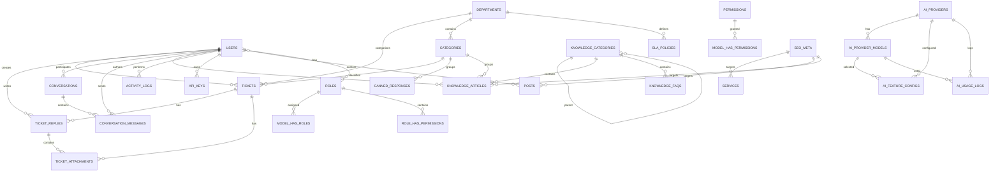

# 03 — Entity Relationship Diagram (ERD)

## Overview

HelpDesk AI has **30+ database tables** organized around 11 domain modules. Below is the complete entity relationship diagram with all tables, relationships, and key fields.

---

## ERD (Mermaid)



---

## All Tables (30+)

| # | Table | Module | Description |
|---|-------|--------|-------------|
| 1 | `users` | Auth | User accounts (admin, agent, customer) |
| 2 | `password_reset_tokens` | Auth | Password reset tokens |
| 3 | `sessions` | Auth | User sessions (database driver) |
| 4 | `cache` | System | Application cache |
| 5 | `cache_locks` | System | Atomic cache locks |
| 6 | `jobs` | Queue | Queued jobs |
| 7 | `job_batches` | Queue | Job batch metadata |
| 8 | `failed_jobs` | Queue | Failed job records |
| 9 | `permissions` | RBAC | Spatie permission definitions |
| 10 | `roles` | RBAC | Spatie role definitions |
| 11 | `model_has_permissions` | RBAC | Direct permission-to-model assignments |
| 12 | `model_has_roles` | RBAC | Role-to-model assignments |
| 13 | `role_has_permissions` | RBAC | Permission-to-role assignments |
| 14 | `departments` | Core | Support departments (IT, Billing, etc.) |
| 15 | `categories` | Core | Ticket categories per department |
| 16 | `tickets` | Core | Support tickets |
| 17 | `ticket_replies` | Core | Replies on tickets |
| 18 | `ticket_attachments` | Core | File attachments on tickets/replies |
| 19 | `conversations` | Chat | Live chat conversations |
| 20 | `conversation_messages` | Chat | Chat messages |
| 21 | `knowledge_categories` | KB | Knowledge base categories (hierarchical) |
| 22 | `knowledge_articles` | KB | Knowledge base articles |
| 23 | `knowledge_faqs` | KB | FAQ entries |
| 24 | `ai_providers` | AI | User-defined AI providers |
| 25 | `ai_provider_models` | AI | Models per AI provider |
| 26 | `ai_feature_configs` | AI | Per-feature provider/model mapping |
| 27 | `ai_usage_logs` | AI | AI usage tracking & cost |
| 28 | `canned_responses` | Productivity | Pre-written reply templates |
| 29 | `sla_policies` | Productivity | SLA policies per department/priority |
| 30 | `automation_rules` | Productivity | Event-driven automation rules |
| 31 | `email_templates` | Productivity | Email notification templates |
| 32 | `settings` | System | Key-value application settings |
| 33 | `services` | Content | Service/product pages (landing) |
| 34 | `posts` | Content | Blog posts |
| 35 | `notifications` | System | Database notifications |
| 36 | `activity_logs` | System | Audit trail / activity log |
| 37 | `seo_meta` | SEO | Per-entity SEO metadata (polymorphic) |
| 38 | `api_keys` | API | User API tokens |

---

## Core Relationships

### User → Everything

```
User (1) ──── (N) Ticket          (user_id)
User (1) ──── (N) TicketReply     (user_id)
User (1) ──── (N) Conversation    (user_id)
User (1) ──── (N) ConversationMessage (user_id)
User (1) ──── (N) KnowledgeArticle(user_id)
User (1) ──── (N) ActivityLog     (user_id)
User (1) ──── (N) ApiKey          (user_id)
User (1) ──── (N) Post            (user_id)
User (N) ──── (N) Role            (via model_has_roles)
```

### Ticket → Sub-entities

```
Ticket (1) ──── (N) TicketReply       (ticket_id)
Ticket (1) ──── (N) TicketAttachment  (ticket_id)
Ticket (1) ──── (1) Department        (department_id)
Ticket (1) ──── (1) Category          (category_id)
Ticket (1) ──── (1) User (creator)    (user_id)
Ticket (1) ──── (1) User (assigned)   (assigned_to)
```

### AI Provider → Models / Configs / Logs

```
AiProvider (1) ──── (N) AiProviderModel  (provider_id)
AiProvider (1) ──── (N) AiFeatureConfig  (provider_id)
AiProvider (1) ──── (N) AiUsageLog       (provider_id)
AiProviderModel (1) ──── (N) AiFeatureConfig (model_id)
AiProviderModel (1) ──── (N) AiUsageLog      (model_id)
```

### Department → Tickets / Categories / SLA

```
Department (1) ──── (N) Ticket       (department_id)
Department (1) ──── (N) Category     (department_id)
Department (1) ──── (N) SlaPolicy    (department_id)
```

### Knowledge Base Hierarchy

```
KnowledgeCategory (1) ──── (N) KnowledgeCategory (parent_id, self-referential)
KnowledgeCategory (1) ──── (N) KnowledgeArticle  (category_id)
KnowledgeCategory (1) ──── (N) KnowledgeFaq      (category_id)
```

### Conversation → Messages

```
Conversation (1) ──── (N) ConversationMessage (conversation_id)
Conversation (1) ──── (1) User (participant)  (user_id)
Conversation (1) ──── (1) User (agent)        (assigned_to)
```

---

## Key Fields Summary

### users
| Field | Type | Notes |
|-------|------|-------|
| id | BIGINT PK | Auto-increment |
| name | VARCHAR(255) | |
| email | VARCHAR(255) UNIQUE | |
| role | ENUM(admin,agent,customer) | Default: customer |
| avatar | VARCHAR(255) NULL | |
| phone | VARCHAR(255) NULL | |
| timezone | VARCHAR(255) NULL | |
| last_active_at | TIMESTAMP NULL | |
| is_active | BOOLEAN | Default: true |
| email_verified_at | TIMESTAMP NULL | |
| password | VARCHAR(255) | Hashed (bcrypt, 12 rounds) |

### tickets
| Field | Type | Notes |
|-------|------|-------|
| id | BIGINT PK | Auto-increment |
| uid | VARCHAR(50) UNIQUE | e.g., TKT-A3B9X |
| user_id | FK → users | Creator |
| assigned_to | FK → users NULL | Assigned agent |
| department_id | FK → departments | |
| category_id | FK → categories | |
| subject | VARCHAR(255) | |
| body | TEXT | |
| priority | ENUM(low,medium,high,urgent) | Default: medium |
| status | ENUM(open,in_progress,answered,resolved,closed) | Default: open |
| source | ENUM(web,email,chat,api) | Default: web |
| sla_due_at | DATETIME NULL | SLA breach deadline |
| closed_at | DATETIME NULL | |
| is_starred | BOOLEAN | Default: false |
| custom_fields | JSON NULL | Free-form fields |

### ai_providers
| Field | Type | Notes |
|-------|------|-------|
| id | BIGINT PK | Auto-increment |
| name | VARCHAR(100) | User-given name |
| api_format | ENUM(openai_compatible,anthropic,gemini) | Format type |
| base_url | VARCHAR(500) | User-provided endpoint |
| api_key_encrypted | TEXT | AES-256 encrypted |
| extra_headers | JSON NULL | Custom HTTP headers |
| is_active | BOOLEAN | Default: true |
| last_tested_at | TIMESTAMP NULL | |
| last_test_status | VARCHAR(20) NULL | success/failure |

---

## Index Decisions

| Table | Index | Type | Reason |
|-------|-------|------|--------|
| users | email | UNIQUE | Login lookup |
| tickets | uid | UNIQUE | Ticket reference lookup |
| tickets | status | INDEX | Filter by status |
| tickets | priority | INDEX | Filter by priority |
| tickets | source | INDEX | Filter by source |
| tickets | closed_at | INDEX | Date range queries |
| ticket_replies | ticket_id | INDEX | Fetch replies for ticket |
| ticket_attachments | ticket_id | INDEX | Fetch attachments for ticket |
| conversation_messages | conversation_id | INDEX | Fetch messages for conversation |
| knowledge_articles | slug | UNIQUE | URL lookup |
| knowledge_articles | status | INDEX | Filter published/draft |
| knowledge_articles | is_featured | INDEX | Featured article filter |
| knowledge_categories | slug | UNIQUE | URL lookup |
| canned_responses | slug | UNIQUE | URL lookup |
| ai_provider_models | provider_id | INDEX | Models per provider |
| ai_feature_configs | feature_key | UNIQUE | One config per feature |
| ai_usage_logs | feature_key | INDEX | Filter by feature |
| ai_usage_logs | created_at | INDEX | Date range queries |
| email_templates | key | UNIQUE | Template retrieval |
| settings | key | UNIQUE | Key-based lookup |
| api_keys | key | UNIQUE | Token lookup |
| api_keys | user_id | INDEX | Keys per user |
| posts | slug | UNIQUE | Blog URL lookup |
| posts | status | INDEX | Filter published/draft |
| posts | published_at | INDEX | Sort by publish date |
| services | slug | UNIQUE | Service page URL |
| activity_logs | action | INDEX | Filter by action type |
| activity_logs | (target_type, target_id) | INDEX | Polymorphic lookup |
| activity_logs | created_at | INDEX | Date range queries |
| seo_meta | (target_type, target_id) | INDEX | Polymorphic lookup |
| sessions | user_id | INDEX | Session lookup |
| sessions | last_activity | INDEX | Session garbage collection |
